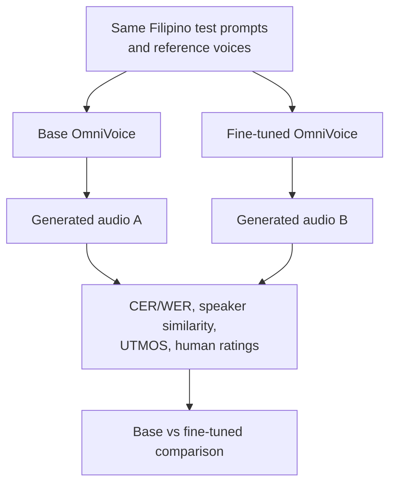

# Research Proposal Presentation: Filipino Fine-Tuning of OmniVoice

10-minute proposal deck content

## Slide 1: Title

**Low-Resource Filipino Adaptation of OmniVoice for Voice Cloning and Text-to-Speech**

Research Project Proposal  
Current Trends

---

## Slide 2: Research Problem

Voice cloning is an emerging AI technology that can synthesize speech in a target speaker's voice from a short reference audio.

**Problem Context**

- Most high-quality voice cloning systems are strongest in high-resource languages.
- Filipino speech AI remains relatively low-resource.
- There are few open, Filipino-focused voice cloning workflows.
- A practical opportunity is to adapt an existing multilingual model instead of training from scratch.

---

## Slide 3: Motivation

- Filipino voice cloning can support education, accessibility, narration, localization, and Filipino language learning tools.
- Multilingual TTS models report wide language coverage, but quality can still vary across low-resource languages.
- OmniVoice supports Filipino, but its language table lists only about **7.71 hours** of Filipino in the training mixture.

**Research Opportunity**

Evaluate whether curated Filipino speech can improve a pretrained multilingual voice cloning model.

---

## Slide 4: Background - OmniVoice

- Open-source multilingual zero-shot TTS and voice cloning model.
- Supports 600+ languages, including Filipino.
- Uses a diffusion language model-style masked-token generation approach.
- Supports:
  - voice cloning from reference audio;
  - voice design from speaker attributes;
  - automatic voice generation from text.
- Provides official fine-tuning scripts using JSONL manifests and WebDataset shards.

Source: Zhu et al. (2026).

---

## Slide 5: Filipino Coverage in OmniVoice

- OmniVoice reports 646 supported languages and 581k hours of total training data.
- Filipino is included with language ID `fil`.
- Filipino has about **7.71 hours** in the OmniVoice training mixture.

**Research angle:** Filipino exists in the base model, but the available Filipino training hours are low compared with major languages.

---

## Slide 6: Research Question and Scope

**Main Research Question**

How much does Filipino-specific fine-tuning improve OmniVoice performance for Filipino TTS and voice cloning across intelligibility, naturalness, and speaker similarity metrics?

**Scope**

- Model: `k2-fsa/OmniVoice`
- Language: Filipino (`fil`)
- Dataset: Filipino subset of UP-DSP Philippine Languages Database
- Method: fine-tuning, not training from scratch
- Output: proposal-stage experiment plan, generated samples, and evaluation results after implementation

**Comparison baseline:** measure the fine-tuned model against the base OmniVoice checkpoint, then report the size of the change per metric.

---

## Slide 7: Objectives

1. Prepare a clean Filipino speech-text dataset for OmniVoice fine-tuning.
2. Fine-tune the pretrained OmniVoice checkpoint on Filipino read speech.
3. Generate Filipino speech using both base and fine-tuned models.
4. Evaluate intelligibility, naturalness, and speaker similarity.
5. Produce a reproducible workflow and demo samples for the existing voice cloning app.

---

## Slide 8: Related Work

- **VALL-E / Neural Codec Language Models**: showed zero-shot TTS using discrete speech tokens.
- **Voicebox**: large-scale multilingual text-guided speech generation.
- **F5-TTS and E2 TTS**: efficient non-autoregressive zero-shot TTS using flow matching.
- **MaskGCT**: zero-shot TTS with masked generative codec modeling.
- **OmniVoice**: extends multilingual zero-shot TTS toward 600+ languages using diffusion language model-style generation.
- **UP-DSP PLD**: provides Filipino and Philippine-language speech data for low-resource speech systems.

---

## Slide 9: Dataset

**UP-DSP Philippine Languages Database**

- Released through Mozilla Data Collective
- WAV audio with LOG transcript files
- License: CC-BY-NC-4.0
- Research use only; not for commercial deployment

**Filipino subset**

| Detail | Value |
|---|---:|
| Language ID | `fil` |
| Speakers | 135 |
| Utterances | 52,879 |
| Duration | 48:56:36 |
| Average utterance length | 3.58 seconds |

Source: Guevara et al. (2024).

---

## Slide 10: Filipino Dataset Statistics

**Filipino subset from PLD**

- 135 speakers
- 52,879 utterances
- 48:56:36 total duration
- 3.58 seconds average utterance length

This is enough for a small fine-tuning study while staying feasible on Kaggle.

---

## Slide 11: Data Choice

**Read Speech**

- Speaker reads a prepared prompt.
- Transcript is already matched to the spoken sentence.
- Best first subset for TTS fine-tuning.

**Spontaneous Speech**

- Speaker answers freely.
- The prompt/question may not be the actual transcript.
- Useful later, but requires transcript verification.

**Project Decision**

Use Filipino read speech first to reduce transcript-audio mismatch.

---

## Slide 12: OmniVoice Architecture

1. Text is encoded with a language-model tokenizer.
2. Reference audio is converted into discrete acoustic tokens.
3. The model receives text, language tags, and optional reference voice tokens.
4. During training, some acoustic tokens are masked.
5. The model learns to reconstruct the masked tokens.
6. During inference, generated tokens are decoded into speech audio.

**Fine-tuning goal:** adapt the text-to-acoustic-token mapping toward Filipino speech patterns.

---

## Slide 13: Proposed Fine-Tuning Pipeline

---

## Slide 14: Methodology

1. Acquire the Filipino PLD subset.
2. Parse WAV and LOG files into OmniVoice JSONL format.
3. Filter clean read speech clips between 1 and 15 seconds, excluding spontaneous, parenthetical, and digit-containing prompts.
4. Split into train, development, and test sets.
5. Tokenize audio using the OmniVoice audio tokenizer.
6. Fine-tune `k2-fsa/OmniVoice` on Kaggle T4 GPUs.
7. Generate matched test samples from base and fine-tuned models.
8. Compare outputs using objective metrics and listener evaluation.

---

## Slide 15: Fine-Tuning Setup

**Environment**

- Kaggle notebook with 2x NVIDIA T4 GPUs
- PyTorch, Hugging Face Transformers, Accelerate, DeepSpeed

**Initial configuration**

| Setting | Planned value |
|---|---|
| Starting checkpoint | `k2-fsa/OmniVoice` |
| Data size | 39.772 hours clean Filipino read speech |
| Precision | FP16 |
| Attention | SDPA |
| Learning rate | `5e-6` |
| Steps | `1,000-2,000` |
| Optimization | DeepSpeed ZeRO-2 |

---

## Slide 16: Evaluation Design

---

## Slide 17: Model Testing and Metrics

**Compared Systems**

| System | Description |
|---|---|
| Base OmniVoice | Original pretrained checkpoint |
| Fine-tuned OmniVoice | Adapted using Filipino read speech |

**Metrics**

- **CER/WER**: intelligibility from ASR transcript vs target text.
- **Speaker similarity**: reference voice vs generated voice embeddings.
- **UTMOS**: predicted speech naturalness, if feasible.
- **Human ratings**: Filipino listener judgment of pronunciation, naturalness, intelligibility, similarity, and preference.

OmniVoice uses the same metric families in its paper: WER/CER for intelligibility, SIM-o for speaker similarity, UTMOS for naturalness, and human MOS-style ratings.

---

## Slide 18: How the Metrics Work

**CER/WER: "Did the model say the right words?"**

- Generate audio from Filipino text.
- Transcribe the generated audio using ASR.
- Compare ASR output with the original target text.
- Lower error rate means clearer, more intelligible speech.

**Speaker Similarity: "Does it still sound like the reference speaker?"**

- Extract speaker embeddings from reference and generated audio.
- Compare them using cosine similarity.
- Higher similarity means stronger voice cloning.

**UTMOS / Human Ratings: "Does it sound natural to listeners?"**

- UTMOS estimates naturalness automatically.
- Human raters judge pronunciation, naturalness, similarity, and preference.

---

## Slide 19: Expected Contribution

- A practical Filipino OmniVoice fine-tuning workflow.
- Cleaned Filipino JSONL manifests and experiment setup.
- Base-vs-fine-tuned comparison using measurable metrics.
- Generated audio samples for the existing voice cloning application.
- Evidence on whether low-resource Filipino adaptation is feasible under limited compute.

---

## Slide 20: Application Use Case - Voice Cloning

---

## Slide 21: Application Use Case - Speech Generation

---

## Slide 22: Application Use Case - Clone Workflow

---

## Slide 23: References

Chen, S., Wang, C., Wu, Y., Zhang, Z., Zhou, L., Liu, S., Chen, Z., Liu, Y., Wang, H., Li, J., et al. (2025). *Neural codec language models are zero-shot text to speech synthesizers*. IEEE/ACM Transactions on Audio, Speech, and Language Processing.

Chen, Y., Niu, Z., Ma, Z., Deng, K., Wang, C., Zhao, J., Yu, K., & Chen, X. (2024). *F5-TTS: A fairytaler that fakes fluent and faithful speech with flow matching*. arXiv. https://arxiv.org/abs/2410.06885

Guevara, R. C. L., Cajote, R. D., Bayona, M. G. A. R., & Lucas, C. R. G. (2024). *Philippine Languages Database: A multilingual speech corpora for developing systems for low-resource languages*. Proceedings of SIGUL 2024, 264-271. https://aclanthology.org/2024.sigul-1.32/

Le, M., Vyas, A., Shi, B., Karrer, B., Sari, L., Moritz, R., Williamson, M., Manohar, V., Adi, Y., Mahadeokar, J., et al. (2023). *Voicebox: Text-guided multilingual universal speech generation at scale*. Advances in Neural Information Processing Systems, 36, 14005-14034.

UP EEEI - Digital Signal Processing Laboratory. (2026). *UP-DSP Philippine Languages Database (UP-DSP-PLD)*. Mozilla Data Collective. https://mozilladatacollective.com/datasets/cmmxhw46c00tqnw07xyr94zjk

Wang, Y., Zhan, H., Liu, L., Zeng, R., Guo, H., Zheng, J., Zhang, Q., Zhang, X., Zhang, S., & Wu, Z. (2025). *MaskGCT: Zero-shot text-to-speech with masked generative codec transformer*. International Conference on Learning Representations.

Zhu, H., Ye, L., Kang, W., Yao, Z., Guo, L., Kuang, F., Han, Z., Zhuang, W., Lin, L., & Povey, D. (2026). *OmniVoice: Towards omnilingual zero-shot text-to-speech with diffusion language models*. arXiv. https://arxiv.org/abs/2604.00688
