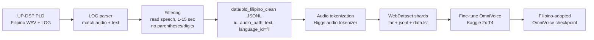
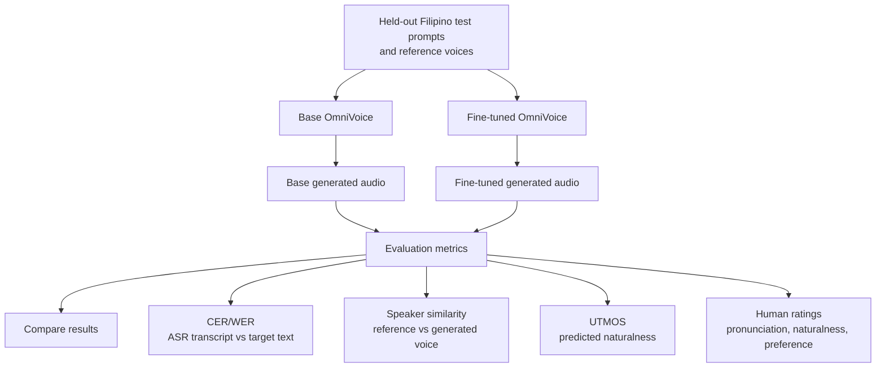
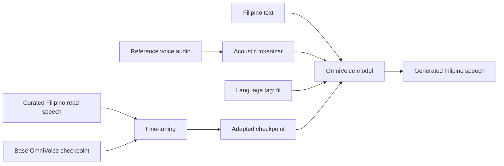

# OmniVoice Filipino Fine-Tuning Execution Plan

This document is the practical execution plan for fine-tuning OmniVoice on Filipino using the UP-DSP Philippine Languages Database (PLD) in Kaggle with T4 GPUs.

## Goal

Fine-tune the pretrained `k2-fsa/OmniVoice` model on curated Filipino read speech and compare it against the base OmniVoice model.

The project is not about adding Filipino support from scratch. OmniVoice already supports Filipino (`fil`). The project is about testing whether Filipino-specific adaptation improves:

- intelligibility;
- pronunciation;
- naturalness;
- speaker similarity in voice cloning.

## Target Output

By the end, we should have:

1. Cleaned Filipino train/dev/test JSONL manifests.
2. Tokenized OmniVoice WebDataset shards.
3. A fine-tuned OmniVoice checkpoint.
4. Base vs fine-tuned generated audio samples.
5. Evaluation results table.
6. A short methodology and results section for the research paper.

## Repository

The OmniVoice repository has already been cloned locally:

```text
.OmniVoice/
```

Relevant files:

```text
.OmniVoice/examples/run_finetune.sh
.OmniVoice/examples/config/train_config_finetune_sdpa.json
.OmniVoice/examples/config/data_config_finetune.json
.OmniVoice/examples/config/ds_config_zero2.json
.OmniVoice/docs/data_preparation.md
.OmniVoice/docs/evaluation.md
```

## Dataset

Primary dataset:

- Name: UP-DSP Philippine Languages Database (UP-DSP-PLD)
- Release page: https://mozilladatacollective.com/datasets/cmmxhw46c00tqnw07xyr94zjk
- Paper: https://aclanthology.org/2024.sigul-1.32.pdf
- Format: WAV audio plus LOG transcript files
- License: CC-BY-NC-4.0
- Size: 45.63 GB

Filipino subset from the paper:

- Language ID: `fil`
- Speakers: 135
- Utterances: 52,879
- Duration: 48:56:36
- Average utterance length: 3.5796 seconds

Use Filipino read speech first. Read speech is safer because the transcript is the prompt that the speaker read aloud. Avoid spontaneous speech in the first run unless the LOG files clearly contain the actual spoken response transcript.

Current local prepared dataset:

```text
data/pld_filipino_clean/
  wavs/
  train.jsonl
  dev.jsonl
  test.jsonl
```

This is the upload-ready Kaggle dataset. It is a standalone cleaned package with only selected WAV files and OmniVoice JSONL manifests. The raw PLD extraction is kept in `data_artifacts/original_pld/` for reproducibility.

Current cleaned counts:

| Split | Samples | Percent | Hours |
| --- | ---: | ---: | ---: |
| train | 33,448 | 79.12% | 31.902 |
| dev | 4,506 | 10.66% | 3.705 |
| test | 4,322 | 10.22% | 4.165 |
| total | 42,276 | 100% | 39.772 |

Filters already applied:

- kept read/prompted speech only;
- excluded spontaneous prompt sources: `TGL_spontaneous.txt`, `TGL_Spo_xaa.txt`, `TGL_Spo_xab.txt`, `TGL_Spo_xac.txt`;
- excluded rows whose transcript contains parentheses;
- excluded rows whose transcript contains digits;
- excluded unreadable or zero-byte WAV files;
- kept duration range from 1.0 to 15.0 seconds;
- split by speaker into train/dev/test.

## High-Level Workflow

1. Use the prepared `data/pld_filipino_clean/` dataset.
2. Upload or attach `data/pld_filipino_clean/` as a Kaggle dataset.
3. Install OmniVoice in Kaggle.
4. Tokenize train/dev audio into WebDataset shards.
5. Fine-tune OmniVoice.
6. Generate base and fine-tuned outputs.
7. Evaluate results.
8. Write findings.

## Architecture Diagrams

### Fine-Tuning Pipeline



### Evaluation Pipeline



### Model Adaptation View



## Phase 1: Dataset Preparation

Status: complete. The final pre-Kaggle dataset is `data/pld_filipino_clean/`.

### 1. Inspect Extracted Dataset Structure

After downloading and extracting PLD, inspect the folder structure. The paper says recordings are grouped by language and speaker, and each speaker folder contains WAV files and LOG files.

Expected structure may look similar to:

```text
PLD/
  fil/
    0000/
      0000.110816.031856.log
      0000.110816.031856.0001.wav
      0000.110816.031856.0002.wav
    0001/
      ...
```

Observed local structure:

```text
data/
  0000/
    0000.110816.021250.log
    0000.110816.021250.0001.wav
    ...
```

### 2. Parse LOG Files

Implemented by:

```text
scripts/prepare_omnivoice_filipino.py
```

Final JSONL rows contain only OmniVoice-required fields:

```jsonl
{"id":"0000.110816.021250.0001","audio_path":"wavs/0000/0000.110816.021250.0001.wav","text":"manugang","language_id":"fil"}
```

### 3. Filter Samples

Applied filters:

- Filipino only: `language_id == "fil"`
- read/prompted speech only;
- duration between 1.0 and 15.0 seconds;
- transcript is not empty;
- transcript is not a placeholder question for spontaneous speech;
- WAV file exists and can be decoded;
- transcript does not contain parentheses;
- transcript does not contain digits.

### 4. Text Normalization

Keep normalization light. Avoid changing Filipino orthography aggressively.

Recommended:

- strip leading/trailing spaces;
- collapse repeated spaces;
- remove control characters;
- normalize whitespace.

Avoid:

- translating text;
- lowercasing everything without checking impact;
- removing punctuation blindly;
- using English-oriented text normalization that may distort Filipino.
- expanding digits for this run, because digit prompts were excluded.

### 5. Split Strategy

Implemented speaker-disjoint split:

- train: 33,448 samples, 31.902 hours;
- dev: 4,506 samples, 3.705 hours;
- test: 4,322 samples, 4.165 hours.

Keep a separate small evaluation set of 20-50 sentences for audio generation comparisons.

## Phase 2: Kaggle Setup

Use a Kaggle notebook with GPU accelerator set to 2x T4 if available.

Recommended Kaggle directories:

```text
/kaggle/input/pld-filipino-clean/  # uploaded data/pld_filipino_clean dataset
/kaggle/working/OmniVoice/         # cloned repo
/kaggle/working/data/              # copied JSONL manifests and tokenized shards
/kaggle/working/exp/               # checkpoints
/kaggle/working/results/           # generated audio and eval outputs
```

### Install Dependencies

Start with:

```bash
git clone https://github.com/k2-fsa/OmniVoice.git
cd OmniVoice
pip install -e .
pip install deepspeed
```

If Kaggle has incompatible PyTorch or Transformers versions, resolve those before training. OmniVoice requires modern `torch`, `torchaudio`, and `transformers`.

### Check GPU

```bash
nvidia-smi
python - <<'PY'
import torch
print(torch.__version__)
print(torch.cuda.is_available())
print(torch.cuda.device_count())
for i in range(torch.cuda.device_count()):
    print(i, torch.cuda.get_device_name(i))
PY
```

## Phase 3: Create Kaggle Training Config

Create:

```text
OmniVoice/examples/config/train_config_finetune_kaggle_t4.json
```

Recommended first config:

```json
{
  "llm_name_or_path": "Qwen/Qwen3-0.6B",
  "audio_vocab_size": 1025,
  "audio_mask_id": 1024,
  "num_audio_codebook": 8,
  "audio_codebook_weights": [8, 8, 6, 6, 4, 4, 2, 2],
  "drop_cond_ratio": 0.1,
  "prompt_ratio_range": [0.0, 0.3],
  "mask_ratio_range": [0.0, 1.0],
  "language_ratio": 1.0,
  "use_pinyin_ratio": 0.0,
  "instruct_ratio": 0.0,
  "only_instruct_ratio": 0.0,
  "resume_from_checkpoint": null,
  "init_from_checkpoint": "k2-fsa/OmniVoice",
  "learning_rate": 5e-6,
  "weight_decay": 0.01,
  "max_grad_norm": 1.0,
  "steps": 2000,
  "seed": 42,
  "warmup_type": "ratio",
  "warmup_ratio": 0.01,
  "warmup_steps": 0,
  "batch_tokens": 1024,
  "gradient_accumulation_steps": 4,
  "num_workers": 2,
  "mixed_precision": "fp16",
  "allow_tf32": false,
  "use_deepspeed": true,
  "deepspeed_config": "examples/config/ds_config_zero2_fp16.json",
  "attn_implementation": "sdpa",
  "max_sample_tokens": 1200,
  "min_sample_tokens": 50,
  "max_batch_size": 16,
  "logging_steps": 25,
  "eval_steps": 250,
  "save_steps": 250,
  "keep_last_n_checkpoints": 2
}
```

Create:

```text
OmniVoice/examples/config/ds_config_zero2_fp16.json
```

Use:

```json
{
  "steps_per_print": 100,
  "zero_optimization": {
    "stage": 2,
    "allgather_partitions": true,
    "allgather_bucket_size": 200000000,
    "overlap_comm": true,
    "reduce_scatter": true,
    "reduce_bucket_size": 200000000,
    "contiguous_gradients": true
  },
  "gradient_accumulation_steps": "auto",
  "gradient_clipping": "auto",
  "train_batch_size": "auto",
  "train_micro_batch_size_per_gpu": "auto",
  "fp16": {
    "enabled": "auto"
  }
}
```

Create or edit:

```text
OmniVoice/examples/config/data_config_finetune_fil.json
```

Use:

```json
{
  "train": [
    {
      "language_id": "fil",
      "manifest_path": ["/kaggle/working/data/finetune/tokens/train/data.lst"],
      "repeat": 1
    }
  ],
  "dev": [
    {
      "language_id": "fil",
      "manifest_path": ["/kaggle/working/data/finetune/tokens/dev/data.lst"],
      "repeat": 1
    }
  ]
}
```

## Phase 4: Tokenize Audio

Tokenization is done inside the Kaggle notebook, after uploading `data/pld_filipino_clean/`.
The uploaded dataset is the clean source artifact; tokenized WebDataset shards are generated training artifacts under `/kaggle/working`.

If Kaggle mounts the uploaded dataset read-only, copy it first:

```bash
mkdir -p /kaggle/working/data_clean
cp -r /kaggle/input/pld-filipino-clean/* /kaggle/working/data_clean/
```

Tokenize train:

```bash
cd /kaggle/working/OmniVoice
export PYTHONPATH=/kaggle/working/OmniVoice:$PYTHONPATH
export CUDA_VISIBLE_DEVICES=0,1

cd /kaggle/working/data_clean

python -m omnivoice.scripts.extract_audio_tokens \
  --input_jsonl train.jsonl \
  --tar_output_pattern /kaggle/working/data/finetune/tokens/train/audios/shard-%06d.tar \
  --jsonl_output_pattern /kaggle/working/data/finetune/tokens/train/txts/shard-%06d.jsonl \
  --tokenizer_path eustlb/higgs-audio-v2-tokenizer \
  --nj_per_gpu 1 \
  --shuffle True \
  --min_length 1.0 \
  --max_length 15.0 \
  --skip_errors True
```

Tokenize dev:

```bash
python -m omnivoice.scripts.extract_audio_tokens \
  --input_jsonl dev.jsonl \
  --tar_output_pattern /kaggle/working/data/finetune/tokens/dev/audios/shard-%06d.tar \
  --jsonl_output_pattern /kaggle/working/data/finetune/tokens/dev/txts/shard-%06d.jsonl \
  --tokenizer_path eustlb/higgs-audio-v2-tokenizer \
  --nj_per_gpu 1 \
  --shuffle False \
  --min_length 1.0 \
  --max_length 15.0 \
  --skip_errors True
```

Confirm manifests exist:

```bash
ls -lh /kaggle/working/data/finetune/tokens/train/data.lst
ls -lh /kaggle/working/data/finetune/tokens/dev/data.lst
```

## Phase 5: Fine-Tune

Run:

```bash
cd /kaggle/working/OmniVoice
export PYTHONPATH=/kaggle/working/OmniVoice:$PYTHONPATH
export CUDA_VISIBLE_DEVICES=0,1

accelerate launch \
  --gpu_ids "0,1" \
  --num_processes 2 \
  -m omnivoice.cli.train \
  --train_config examples/config/train_config_finetune_kaggle_t4.json \
  --data_config examples/config/data_config_finetune_fil.json \
  --output_dir /kaggle/working/exp/omnivoice_fil_finetune
```

If the run fails with OOM, reduce:

1. `batch_tokens`: `1024` to `768` to `512`
2. `max_batch_size`: `16` to `8`
3. `max_sample_tokens`: `1200` to `900`
4. `num_workers`: `2` to `1`
5. temporarily remove dev evaluation by setting `"dev": []` in the data config

## Phase 6: Generate Evaluation Audio

Prepare a test JSONL for generation:

```jsonl
{"id":"test_001","text":"Magandang umaga sa inyong lahat.","language_id":"fil","ref_audio":"/kaggle/working/eval_refs/ref_001.wav","ref_text":"Reference transcript here."}
{"id":"test_002","text":"Ang teknolohiya ng boses ay mabilis na umuunlad.","language_id":"fil","ref_audio":"/kaggle/working/eval_refs/ref_001.wav","ref_text":"Reference transcript here."}
```

Generate with base model:

```bash
python -m omnivoice.cli.infer_batch \
  --model k2-fsa/OmniVoice \
  --test_list /kaggle/working/data/fil_test_generation.jsonl \
  --res_dir /kaggle/working/results/base_omnivoice_fil
```

Generate with fine-tuned model:

```bash
python -m omnivoice.cli.infer_batch \
  --model /kaggle/working/exp/omnivoice_fil_finetune/checkpoint-2000 \
  --test_list /kaggle/working/data/fil_test_generation.jsonl \
  --res_dir /kaggle/working/results/finetuned_omnivoice_fil
```

Adjust checkpoint number based on the best available checkpoint.

## Phase 7: Evaluate

### Objective Evaluation

Minimum objective metric:

- CER or WER from ASR transcription of generated audio.

Suggested ASR:

- `openai/whisper-large-v3-turbo`, if memory allows;
- smaller Whisper model if Kaggle memory/time is limited.

For each generated WAV:

1. Transcribe generated audio.
2. Normalize reference and hypothesis text lightly.
3. Compute CER and/or WER.
4. Compare base vs fine-tuned and report the size of the change.

### Speaker Similarity

If voice cloning mode is used:

1. Compare generated audio to the reference voice audio.
2. Use ECAPA-TDNN or WavLM speaker embeddings.
3. Report cosine similarity. Higher values mean the generated voice is closer to the reference speaker.

### Naturalness

If setup allows:

- Use UTMOS. Higher values mean the generated waveform is predicted to sound more natural.

If not:

- Use human MOS survey.

### Final Full Test-Set Results

The completed comparison is a controlled learning-rate sweep: three 5000-step fine-tuning runs with the same best-development-loss checkpoint policy, at learning rates `1e-5`, `2e-5`, and `5e-6`, plus the pretrained base model. The base model was evaluated with `notebooks/omnivoice_evaluation_metrics.py`, the LR `1e-5` checkpoint with `notebooks/omnivoice_evaluation_metrics_finetunes.py`, and the LR `2e-5` and `5e-6` checkpoints with `notebooks/omnivoice_evaluation_metrics_new_lr_reruns.py`. Later runs reused the base model row from the first full evaluation because the test split, manifests, inference settings, evaluator models, and text normalization stayed the same. Exported artifacts for the LR `2e-5`/`5e-6` evaluation live in `eval-2e-5-and-5e-6/`.

| Model | Selection | WER (%) | WER delta vs base | SIM-o | UTMOS |
| --- | --- | ---: | ---: | ---: | ---: |
| Base OmniVoice | pretrained base | 22.55 | 0.00 | 0.602 | 3.64 |
| Best-eval LR 1e-5 | 5000-step run, best development-loss checkpoint at step 4900 | 18.52 | -4.03 | 0.604 | 3.61 |
| Best-eval LR 2e-5 | 5000-step run, best development-loss checkpoint | 18.83 | -3.72 | 0.583 | 3.61 |
| Best-eval LR 5e-6 | 5000-step run, best development-loss checkpoint | 21.96 | -0.59 | 0.605 | 3.60 |

Strongest overall model: the best-eval LR `1e-5` checkpoint (`omnivoice-filipino-full-checkpoint-4900`).

The LR `1e-5` checkpoint reduces WER by 4.03 absolute points versus the base model, from 22.55% to 18.52%, while keeping SIM-o slightly above base. LR `2e-5` nearly matches that intelligibility gain (18.83% WER) but lowers SIM-o to 0.583, the only fine-tune below base. LR `5e-6` preserves speaker similarity best among the fine-tunes (0.605) but improves WER by only 0.59 points. The base model still has the highest UTMOS (3.64), with the fine-tunes close at 3.60-3.61. The result is an intelligibility-versus-speaker-similarity/naturalness tradeoff; for the current research question, LR `1e-5` gives the strongest intelligibility gain without a speaker-similarity or naturalness collapse.

Earlier exploratory final-step checkpoints (1000-step `2e-5` and 2000-step `5e-6`) predate the controlled sweep and are recorded as project history in `progress/2026-05-19-full-train-track-metrics.md`.

### Human Evaluation

Ask Filipino speakers to rate 10-20 samples.

Suggested 1-5 scale criteria:

- pronunciation correctness;
- naturalness;
- intelligibility;
- speaker similarity;
- overall preference between base and fine-tuned.

## Phase 8: Reporting

Paper sections:

1. Introduction
2. Related Work
3. Dataset
4. Methodology
5. Experiment Setup
6. Results
7. Discussion
8. Limitations
9. Conclusion

Key claims to avoid:

- Do not claim the model newly supports Filipino.
- Do not claim commercial readiness.
- Do not claim state-of-the-art unless evaluated against strong baselines.

Key claims that are safe:

- The work evaluates Filipino adaptation of a massively multilingual zero-shot TTS model.
- The study tests whether curated low-resource Filipino speech can improve a pretrained model.
- The implementation is a research prototype using a non-commercial dataset.

## Timeline

### Day 1

- Download dataset.
- Inspect folder and LOG structure.
- Write parser for Filipino WAV/LOG pairs.

### Day 2

- Completed locally: clean and filter Filipino read speech.
- Completed locally: create `data/pld_filipino_clean/train.jsonl`, `data/pld_filipino_clean/dev.jsonl`, and `data/pld_filipino_clean/test.jsonl`.
- Completed locally: run data sanity checks.

### Day 3

- Set up Kaggle notebook.
- Install OmniVoice.
- Tokenize a small subset.
- Run a short 50-100 step smoke test.

### Day 4-5

- Tokenize train/dev manifests in Kaggle.
- Fine-tune for 1,000-2,000 steps.
- Save checkpoints.

### Day 6

- Generate base and fine-tuned samples.
- Run CER/WER evaluation.

### Day 7

- Run human listening survey.
- Create result tables.

### Day 8-10

- Write paper/report.
- Integrate selected audio samples into the web app demo if time allows.

## Go/No-Go Checks

Before full fine-tuning, confirm:

- JSONL rows point to real WAV files.
- WAV files load successfully.
- Transcripts are actual read prompts.
- Tokenization creates `data.lst`.
- A 50-step training smoke test completes.
- The checkpoint can generate audio after the smoke test.

If these pass, proceed to the full 39.772-hour `data/pld_filipino_clean/` package, or use a smaller temporary subset only if Kaggle runtime or memory requires it.
